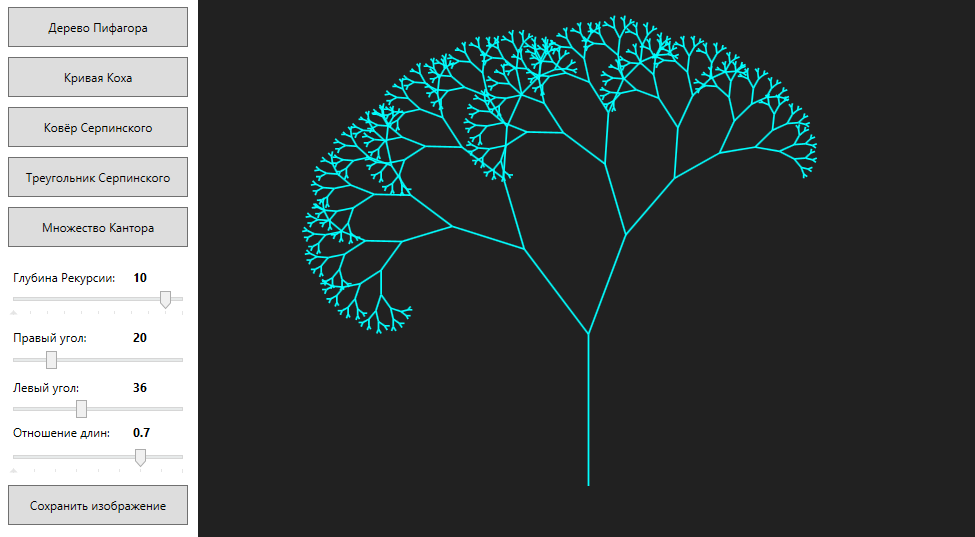

# FractalPainter
WPF Application for drawing fractals.

# Features

* Drawing five types of fractals, such as:
  * Pythagoras tree
  * Koch curve
  * Sierpinski carpet
  * Sierpinski triangle
  * Cantor set
* Changing the recursion depth of fractals.
* For Pythagoras tree: changing left and right angle value, length ratio.
* For Cantor set: changing distance between each level.
* Saving an image of current fractal as a .png file.